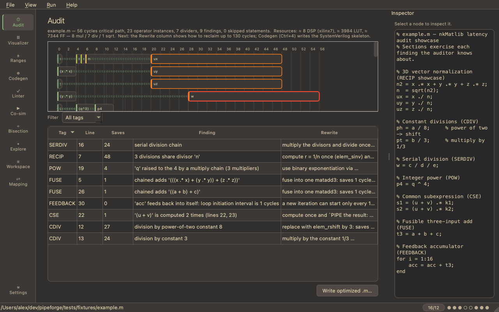

# PipeForge

**MATLAB-to-nkMatlib FPGA pipeline workbench** — audit, verify, visualize, and
generate fixed-point pipelines targeting the
[nkMatlib](https://github.com/nklabs/matlib) SystemVerilog library.

You write straight-line MATLAB DSP code. PipeForge tells you what that code costs
as an nkMatlib pipeline (cycles, multipliers, dividers), how to make it cheaper,
what every value's range and precision will be, whether your hand-written RTL
matches a bit-exact model — and it can write the SystemVerilog skeleton for you,
with every matching delay computed. When RTL and model disagree, it tells you
*which pipeline stage* first diverged and *why*.



---

## Contents

1. [What PipeForge is for](#what-pipeforge-is-for)
2. [Installation](#installation)
   - [Step 1 — Python and the package](#step-1--python-and-the-package)
   - [Step 2 — optional external tools (per OS)](#step-2--optional-external-tools-per-os)
   - [Step 3 — point PipeForge at MATLAB](#step-3--point-pipeforge-at-matlab-optional)
   - [Verify the install](#verify-the-install)
3. [Five-minute tour](#five-minute-tour)
4. [Concepts you need](#concepts-you-need)
5. [The CLI, command by command](#the-cli-command-by-command)
   - [audit](#cli-audit) · [optimize](#cli-optimize) · [codegen](#cli-codegen) ·
     [lint](#cli-lint) · [ranges](#cli-ranges) · [dse](#cli-dse) ·
     [cosim](#cli-cosim) · [ci](#cli-ci) · [synth](#cli-synth) ·
     [export-tb](#cli-export-tb) · [report](#cli-report) · [oracle](#cli-oracle) ·
     [reconcile](#cli-reconcile) · [map](#cli-map) · [mat2json](#cli-mat2json) ·
     [traceability](#cli-traceability) · [matlab](#cli-matlab) · [demos](#cli-demos)
6. [The GUI, view by view](#the-gui-view-by-view)
7. [End-to-end workflows](#end-to-end-workflows)
8. [The MATLAB subset PipeForge understands](#the-matlab-subset-pipeforge-understands)
9. [Configuration and files on disk](#configuration-and-files-on-disk)
10. [Development](#development)
11. [Troubleshooting](#troubleshooting)
12. [Known limitations](#known-limitations)

---

## What PipeForge is for

If you are turning MATLAB DSP into pipelined fixed-point SystemVerilog, the hard
parts are not the arithmetic — they are the *bookkeeping*: how many cycles each
operation costs, which operands need delay-matching, whether 16/12 fixed point
will overflow, and whether the RTL you (or a colleague) wrote actually matches the
math. PipeForge is a single tool that answers all of those, from one MATLAB file,
using one shared cost model so every answer is comparable to every other.

| You want to… | Use | What you need |
|---|---|---|
| Know the cycle cost / divider count of a script | [`audit`](#cli-audit) | a `.m` file |
| See the pipeline as a timeline | [Visualizer](#gui-visualizer) | a `.m` file |
| Generate the SystemVerilog skeleton | [`codegen`](#cli-codegen) | a `.m` file |
| Check hand-written RTL for delay/convention bugs | [`lint`](#cli-lint) | a `.sv` file |
| Find out if 16/12 will overflow or divide-by-near-zero | [`ranges`](#cli-ranges) | a `.m` file + input ranges |
| Pick the best WIDTH/SCALE | [`dse`](#cli-dse) | a `.m` file |
| Prove RTL == model bit-for-bit | [`cosim`](#cli-cosim) | `.m` + `.sv` + Verilator |
| Find *which stage* a failing RTL diverges at | [`cosim --bisect`](#cli-cosim) | `.m` + `.sv` + Verilator |
| Open the failure in a waveform viewer, cursor pre-placed | [`cosim --bisect`](#cli-cosim) + GTKWave | a failing cosim run |
| Re-run the *exact* vectors that failed | [`cosim --replay`](#cli-cosim) | a `failure.json` |
| Hand the same vectors to a colleague / another simulator | [`export-tb`](#cli-export-tb) | a `.m` file |
| Know how many DSP48s / LUTs this costs | [`audit --resources`](#cli-audit) | a `.m` file |
| Sanity-check cells + logic depth before Vivado | [`synth`](#cli-synth) | a `.sv` + yosys |
| Spend fewer bits where ranges prove it's safe | [`codegen --mixed`](#cli-codegen) | a `.m` + input ranges |
| Apply the findings' rewrites automatically | [`optimize`](#cli-optimize) | a `.m` file |
| Turn loops into pipelined / parallel structure | [automatic (LP-1)](#the-matlab-subset-pipeforge-understands) + `optimize` | constant bounds |
| Run the whole gate from one file | [`ci`](#cli-ci) | a `.pipeforge.toml` sidecar |
| Build a filter (z⁻¹ taps) | [`delay(x)`](#the-matlab-subset-pipeforge-understands) | a `.m` file |
| Drop the module into an AXI-Stream design | [`codegen --axis`](#cli-codegen) | a `.m` file |
| Gate pull requests on lint + cosim | [SARIF/JUnit outputs](docs/ci.md) | CI + Verilator |
| Attach one reviewable artifact to a design review | [`report`](#cli-report) | a `.m` file |
| Re-run the audit on every save (headless) | [`audit --watch`](#cli-audit) | a `.m` file |
| Grade the model against captured ground-truth I/O | [`oracle`](#cli-oracle) | `.m` + a `.mat` of vectors |
| Check a `.mat` workspace against its SV `software` mirror | [`reconcile`](#cli-reconcile) | a `.mat` + a `.sv` |
| Map MATLAB variables ↔ RTL signals | [`map`](#cli-map) | `.m` + `.sv` |
| Make the audit shape/type-aware from a `.mat` — **no MATLAB** | [`mat2json`](#cli-mat2json) / `--snapshot file.mat` | a `.mat` file |
| Validate the model against *real* MATLAB values | [`matlab validate`](#cli-matlab) | MATLAB installed |

Two entry points expose all of it:

| Command | What it is |
|---|---|
| `pipeforge` | the GUI (optionally pass a `.m` file to open) |
| `pipeforge-cli` | every capability, headless — `pipeforge-cli -h` lists subcommands |

---

## Installation

PipeForge has three layers of dependency:

1. **The package itself** (Python + a few pip packages) — required, gets you the
   GUI, the audit/codegen/ranges/dse/golden-model/mapping capabilities, and the
   `.mat` loader. This is all most people need.
2. **External EDA tools** (Verilator, Yosys, graphviz, Verible) — each *optional*,
   each unlocks one feature. Missing tools never crash anything: the feature
   reports an actionable "install X to enable this" message and everything else
   keeps working. The GUI status bar shows one availability dot per tool.
3. **MATLAB** — optional, unlocks the live bridge (real types/shapes/values).

### Step 1 — Python and the package

You need **Python ≥ 3.11**. 3.11 or 3.12 are the smoothest choice if you also want
cocotb-based co-simulation (cocotb tracks the CPython release cycle and lags the
newest version by a few months — but note PipeForge also ships a **cocotb-free
co-sim backend** that needs only Verilator, see [`cosim`](#cli-cosim)).

<details open>
<summary><b>Linux (Arch / Ubuntu / Fedora)</b></summary>

```sh
# system Python + venv support (skip if you already have Python 3.11+)
sudo pacman -S python                       # Arch
sudo apt install python3 python3-venv       # Ubuntu/Debian
sudo dnf install python3 python3-pip        # Fedora

git clone <this repo> && cd pipeforge
python -m venv .venv && source .venv/bin/activate
pip install -e ".[dev]"
```
</details>

<details>
<summary><b>macOS</b></summary>

```sh
brew install python@3.12                     # Homebrew Python (recommended)

git clone <this repo> && cd pipeforge
python3.12 -m venv .venv && source .venv/bin/activate
pip install -e ".[dev]"
```

PyQt6 ships as a wheel for both Apple Silicon and Intel — no Qt build needed.
</details>

<details>
<summary><b>Windows</b></summary>

The **GUI and the pure-Python capabilities** (audit, codegen, ranges, dse,
golden model, mapping, `.mat` loading) run natively on Windows:

```powershell
# install Python 3.12 from python.org or: winget install Python.Python.3.12
git clone <this repo> ; cd pipeforge
py -3.12 -m venv .venv ; .venv\Scripts\Activate.ps1
pip install -e ".[dev]"
```

The **simulation/formal tools** (Verilator, Yosys, cocotb, Verible) are far
easier on Linux. For those, install **WSL2** (`wsl --install`, then a distro such
as Ubuntu) and run PipeForge inside it exactly as in the Linux instructions. This
is the recommended setup for co-simulation on Windows.
</details>

`pip install -e ".[dev]"` pulls these automatically (they are declared in
`pyproject.toml`, no manual install needed):

| Package | Why it's needed |
|---|---|
| `numpy` | numeric core throughout |
| `PyQt6`, `pyqtgraph` | the GUI and its plots |
| `scipy` | reads `.mat` workspace files (v5 / v7) |
| `h5py` | reads `.mat` v7.3 (HDF5) workspace files |
| `pytest`, `pytest-cov`, `pytest-qt`, `hypothesis`, `ruff`, `mypy` (the `[dev]` extra) | running the test suite and the gates |

If you only want to *run* PipeForge (not develop it), `pip install -e .` (without
`[dev]`) is enough.

### Step 2 — optional external tools (per OS)

Install only the ones whose feature you want.

#### Verilator — unlocks [co-simulation](#cli-cosim) and trace bisection

This is the highest-value optional tool: it's what lets PipeForge actually *run*
your RTL and prove it bit-for-bit against the model.

| OS | Install |
|---|---|
| Arch | `sudo pacman -S verilator` |
| Ubuntu/Debian | `sudo apt install verilator` (for a recent version, build from source — distro packages can lag) |
| Fedora | `sudo dnf install verilator` |
| macOS | `brew install verilator` |
| Windows | use it inside WSL2 (above), then `apt install verilator` |

Verify: `verilator --version` (PipeForge is tested against 5.x).

#### cocotb — the *default* co-sim harness (optional; Verilator-native is the alternative)

cocotb is a Python package, so it installs into your venv:

```sh
pip install cocotb
```

cocotb requires a supported Python (3.11/3.12 are safe). **You do not need cocotb
if you use `--backend verilator`**, the pure-SystemVerilog native harness that
needs only Verilator — handy if you're on a Python version cocotb hasn't caught up
to yet. Both backends produce bit-identical results.

#### graphviz `dot` — nicer DAG row ordering in the [Visualizer](#gui-visualizer)

Purely cosmetic (the timeline works without it; `dot` just packs rows better).

| OS | Install |
|---|---|
| Arch | `sudo pacman -S graphviz` |
| Ubuntu/Debian | `sudo apt install graphviz` |
| Fedora | `sudo dnf install graphviz` |
| macOS | `brew install graphviz` |
| Windows | `winget install graphviz` |

#### pyslang — full SystemVerilog parsing for the [linter](#cli-lint)

Without it, the linter uses a regex/structural fallback that agrees with pyslang
on the convention corpus; with it you get a real AST. Python package:

```sh
pip install pyslang
```

#### Verible — alternative CST backend for the [linter](#cli-lint)

Google's Verilog tools; the linter can use `verible-verilog-syntax` as a parse
backend (`lint --backend verible` / auto-selected when present).

| OS | Install |
|---|---|
| Arch | AUR: `yay -S verible-bin` |
| Ubuntu/Debian/Fedora/macOS | download a release from <https://github.com/chipsalliance/verible/releases> and put `verible-verilog-syntax` on your `PATH` |
| macOS | `brew install verible` |

Verify: `verible-verilog-syntax --version`.

#### Yosys + SymbiYosys — run the generated [formal](#gui--formal-hooks) projects

PipeForge *generates* the SymbiYosys project regardless; you need these only to
*run* it.

| OS | Install |
|---|---|
| Arch | `sudo pacman -S yosys` and SymbiYosys from the [OSS CAD Suite](https://github.com/YosysHQ/oss-cad-suite-build) |
| Ubuntu/Debian | `sudo apt install yosys`; SymbiYosys via OSS CAD Suite |
| macOS | `brew install yosys`; OSS CAD Suite for `sby` |
| Windows | OSS CAD Suite (Windows build) or WSL2 |

The easiest cross-platform route is the **OSS CAD Suite** — one download with
Yosys, SymbiYosys, and solvers bundled.

### Step 3 — point PipeForge at MATLAB (optional)

The live bridge needs MATLAB itself (no extra Python toolbox — PipeForge talks to
MATLAB through `matlab -batch`). The MATLAB location is **per-machine state**
stored in `~/.config/pipeforge/settings.json`, never committed. Resolution order:

1. Explicit setting (Settings → MATLAB command, or `matlabCommand` in settings.json)
2. `PIPEFORGE_MATLAB` environment variable (a shell-style command string)
3. `matlab` on PATH
4. Standard installs (`/usr/local/MATLAB/R20xx`, `/opt/MATLAB/R20xx`,
   `/Applications/MATLAB_R20xx.app`), newest release first
5. A Distrobox container with "matlab" in its name

On a machine with a normal install it usually just works. To set it up explicitly:

```sh
pipeforge-cli matlab detect
```

This *launches* each candidate until one actually answers, then saves the winner.
The full launch matters: a MATLAB directory can be visible but unrunnable (e.g. a
container install whose path shows on the host). The GUI equivalent is the
**Detect** button in Settings.

### Verify the install

```sh
pipeforge-cli --version                  # pipeforge 0.1.0
pipeforge-cli audit seed/example.m       # should print a full audit report
pipeforge-cli demos                      # list the packaged demos
make verify                              # lint + type-check + full test suite (dev)
```

If a tool is missing, the relevant command prints exactly what to install and
exits cleanly (code 3) — it never half-runs.

---

## Five-minute tour

```sh
# 1. What does this MATLAB cost as a pipeline, and how do I make it cheaper?
pipeforge-cli audit seed/example.m

# 1b. Don't just read the findings — apply them (honest before/after report)
pipeforge-cli optimize seed/example.m -o example_opt.m

# 1c. Have real data in a .mat? Shapes + values sharpen everything (no MATLAB)
pipeforge-cli audit model.m --snapshot params.mat

# 2. Generate the nkMatlib SystemVerilog for it
pipeforge-cli codegen tests/fixtures/normalize3d.m -o normalize3d.sv

# 3. Check the generated (or your hand-written) RTL against the conventions
pipeforge-cli lint normalize3d.sv

# 4. Will 16/12 fixed point overflow? Where could a divide blow up?
pipeforge-cli ranges tests/fixtures/normalize3d.m \
    --range x=-1:1 --range y=-1:1 --range z=-1:1

# 5. What WIDTH/SCALE should I pick? Sweep and look at the Pareto front
pipeforge-cli dse tests/fixtures/normalize3d.m --widths 12,16,20 --scales 8,12,14

# 6. Prove RTL == model bit-for-bit (needs Verilator; cocotb-free native backend)
pipeforge-cli cosim tests/fixtures/cosim/sample.m \
    --sv tests/fixtures/cosim/sample.sv --top cosim_sample \
    --backend verilator --include matlib-main/rtl \
    --source matlib-main/rtl/fixedp.sv --source matlib-main/rtl/smul.sv \
    --source matlib-main/rtl/smul_raw.sv --source matlib-main/rtl/norm.sv \
    --source matlib-main/rtl/add.sv --source matlib-main/rtl/pipe.sv \
    --source matlib-main/rtl/valid.sv
```

Or just run `pipeforge`, hit **Ctrl+O**, open `seed/example.m`, and click around.

---

## Concepts you need

**nkMatlib** is a pipelined fixed-point SystemVerilog library: throughput is one
result per clock, and the latency of a computation is the length of its dataflow
critical path. Operands that arrive at an operator at different times must be
delay-matched with `PIPE` shift registers — getting those delays wrong is the
classic nkMatlib bug, and most of PipeForge exists to compute, check, or generate
them.

**WIDTH / SCALE** define the fixed-point format: WIDTH total bits, SCALE fractional
bits, LEFT = WIDTH − SCALE integer bits (including sign). They are a
*workspace-level* setting (status-bar chip; default **16/12**, i.e. range ±8 with
~0.00024 resolution). **All operator latencies derive from them at runtime** —
there is no hard-coded latency anywhere outside the cost model:

| Operator | Latency |
|---|---|
| add/sub, abs, neg, max/min | 1 |
| multiply (`smul`, `ssqr`) | 4 |
| matrix multiply, sumsqr, cross | 5 |
| divide (`sdiv`, `sinv`) | WIDTH + SCALE (e.g. 28 at 16/12) |
| square root | WIDTH − LEFT/2 (e.g. 14 at 16/12) |
| `norm` (rootsqr) | sqrt + sumsqr (e.g. 19 at 16/12) |
| format convert, transpose, reshape, select | 0 |

Notice dividers dominate everything — which is why several audit findings are about
eliminating them.

**The DAG** is the shared data structure. Your script is parsed into a dataflow
graph; every capability consumes the *same* graph with the *same* node IDs. The
node you click in the Visualizer is the node named in an audit finding, a codegen
instance, a bisection report, and a range row.

**The golden model** is a bit-exact Python re-implementation of nkMatlib's
arithmetic — same truncation directions, same overflow wraps, same divide-by-zero
bit patterns (every decision cited against the RTL source in
`docs/fxp_semantics.md`). "Passes co-simulation" means the RTL equals this model
bit-for-bit, not "approximately".

**Column-major layout.** MATLAB flattens column-major, and PipeForge's flat-lane
golden model stores values in that same order, so `reshape` is the *identity on
values* (no arithmetic, no latency). The contract that keeps RTL aligned — flat
index `i` ↔ `(row, col)` with `row = i % rows`, `col = i // rows`, matching SV
packed `[rows][cols]` — is in `docs/fxp_semantics.md`. This matters for the
[`oracle`](#cli-oracle) and [`reconcile`](#cli-reconcile) workflows.

**Mapping authority.** When PipeForge correlates MATLAB variables to RTL signals
([`map`](#cli-map)), the auto-matcher is a *first-draft proposer only*. Operation
grouping is fully manual. Downstream consumers (traceability, reconcile alignment)
read **only confirmed** mappings — nothing acts on a guess.

---

## The CLI, command by command

Every command shares two conventions: `-w/--width` and `-s/--scale` set the
fixed-point format (default 16/12), and `--json` emits machine-readable output for
scripting/CI. **Exit codes:** `0` success/clean, `1` findings or mismatch (so CI
can gate on it), `2` usage or I/O error, `3` a required external tool is missing.

---

### <a id="cli-audit"></a>`audit` — what does this MATLAB cost as a pipeline?

**Helps you:** see the cycle cost, the critical path, the operator/divider census,
and a list of concrete optimizations *before* you write any RTL.

**You need:** a `.m` file. (Optionally a MATLAB snapshot for shape-true costing.)

```sh
pipeforge-cli audit file.m [-w 16 -s 12] [--json] [--snapshot snap.json]
```

**Tutorial:**

```sh
pipeforge-cli audit seed/example.m
```

You get per-statement **ready times** (the cycle each value becomes available),
the **critical path** (total cycles + the exact dependency chain that sets it), an
**operator census** with the divider count called out, and **findings** — each
with a line number, estimated cycle savings, and a concrete rewrite:

| Tag | Fires when | Suggested rewrite |
|---|---|---|
| `RECIP` | several divisions share one divisor (`x/n; y/n; z/n`) | compute `1/n` once, multiply — k−1 fewer dividers |
| `CDIV` | division by a constant | multiply by the reciprocal; power-of-two → shift |
| `SERDIV` | serial division chain (`a/b/c`) | multiply divisors, divide once |
| `POW` | integer power as a multiply chain | square-and-multiply |
| `CSE` | identical subexpression computed twice | compute once, `PIPE` it |
| `FUSE` | `a+b+c` style chains | one `matadd3` (saves a stage) |
| `FEEDBACK` | a variable feeds back into itself | reports the loop's initiation interval |
| `FORMAT` | (snapshot only) a `fi` variable's format ≠ workspace format | insert `elem_snorm` or adopt the fi format |

**Expect:** auditing is fast (500 statements < 1 s). Statements PipeForge can't
parse are *skipped and listed*, never fatal. Without shape information, `*` is
costed as elementwise multiply and `/` as a full divide — attach a snapshot
(`--snapshot`, see [`matlab`](#cli-matlab)) for true `matmul`/`matscale` costing.

---

### <a id="cli-codegen"></a>`codegen` — write the SystemVerilog skeleton

**Helps you:** turn a `.m` straight into a complete, convention-correct nkMatlib
module with every delay-match computed — the tedious, error-prone part done for you.

**You need:** a `.m` file (one whose constructs are in the supported subset).

```sh
pipeforge-cli codegen file.m [-m module_name] [-o out.sv]
```

**Tutorial:**

```sh
pipeforge-cli codegen tests/fixtures/normalize3d.m -m normalize3d -o normalize3d.sv
pipeforge-cli lint normalize3d.sv          # it lints clean — by construction
```

You get a `fixedp` interface port `g`, `_0` inputs / `_N` outputs, one operator
instance per DAG node with conventional naming, constants via `` `TOFXD``, and
**all** matching delays — operand alignment pipes, early-output alignment to the
final stage, and the reset valid chain.

**Guarantees:** output is deterministic and passes PipeForge's own linter with
zero findings (enforced by tests); the generated sample module passes
co-simulation against the golden model (a CI test runs the whole
parse→generate→simulate→match loop).

**Expect:** opaque constructs (array indexing like `n(:,1)`, concatenation) raise a
clear error naming the line — rewrite without them or extend the generator. Dotted
variables become legal port names (`cfg.gain` → `cfg_gain_0`).

**`--axis`** also emits `<module>_axis.sv`, an AXI-Stream (tvalid/tready)
wrapper that drops into Vivado block designs: the nkMatlib core can't stall, so
a credit counter admits a beat only when the output FIFO (depth ≥ latency,
power of two) is guaranteed a slot when the result lands. Throughput stays 1
beat/clock while the consumer keeps up.

**`--mixed --range name=lo:hi …`** narrows range-proven operators to
per-instance widths (MX-1): the range analysis proves how many integer bits
each value needs; add/sub/mul-class operators (latency-independent of WIDTH)
get the smallest safe width, with one `fixedp` interface per distinct width and
sign-extension/truncation at boundaries — both value-preserving under the
proof. Dividers and sqrts keep the global format (their latency depends on
WIDTH, and narrowing them would change the schedule). Narrow multipliers cost
fewer DSP tiles. Verify with `cosim --range …` — in-range stimulus is exactly
where the proof holds, and there the module is **bit-exact** against the
golden model.

---

### <a id="cli-lint"></a>`lint` — check hand-written RTL for convention/delay bugs

**Helps you:** catch the classic nkMatlib mistakes (mismatched operand delays,
wrong valid chains, reset hazards) using the *same cost model as the audit*, so a
lint stage number is directly comparable to an audit ready time.

**You need:** a `.sv` file. (pyslang or Verible optional for full parsing.)

```sh
pipeforge-cli lint file.sv [-w 16 -s 12] [--disable CHECK] [--no-pyslang] [--json] \
    [--verilator --include matlib-main/rtl] [--sarif out.sarif] [--watch]
```

**Tutorial:**

```sh
pipeforge-cli lint tests/fixtures/cosim/sample.sv          # a clean file
pipeforge-cli lint src/pipeforge/demos/04_lint_bugs.sv     # has injected bugs
```

Checks (each suppressible via `--disable`):

| Check | Catches |
|---|---|
| `delay-match` | operands reaching an instance at different pipeline stages — reports both signals, their stages, and the exact `` `PIPE`` fix |
| `suffix` | `_nn` stage suffixes inconsistent with computed cycles |
| `valid-chain` | valid-signal delay ≠ data-path delay |
| `reset` | valid flops through unreset pipes, or data through reset valid-delays (blocks SRL inference) |
| `naming` | instances not named `i_<module>_<signal>_<stage>` |
| `unknown-module` | instances the cost model can't price |

**`--verilator`** merges `verilator --lint-only -Wall` findings (general SV
problems: width mismatches, latches, UNOPTFLAT) into the same table —
PipeForge synthesizes the throwaway interface harness Verilator needs for
`fixedp`-port modules automatically. **`--sarif FILE`** writes findings as
SARIF 2.1.0 so GitHub annotates the PR inline ([docs/ci.md](docs/ci.md));
**`--watch`** re-lints on every save. The GUI's Linter view has the same
Verilator toggle.

**Expect:** exit code 1 when findings exist (CI-friendly). The active parser
backend is reported (`pyslang`, `verible`, or the regex/structural fallback —
findings agree across them on the test corpus). `pipe`/`valid` instances with
explicit `.DELAY(n)` parameters are priced correctly. Stage arithmetic depends on
WIDTH/SCALE — if the linter flags a correct file, check `-w/-s` match the design.

---

### <a id="cli-ranges"></a>`ranges` — overflow & near-zero-divisor analysis

**Helps you:** find out, *before* simulating, whether your chosen WIDTH/SCALE will
overflow, where a divisor could approach zero, and what format would meet an error
budget.

**You need:** a `.m` file and the input ranges (declared, or filled from a snapshot).

```sh
pipeforge-cli ranges file.m --range x=-1:1 --range n=0.1:4 \
    [--method affine] [--recommend 0.01] [--snapshot snap.json]
```

**Tutorial:**

```sh
pipeforge-cli ranges tests/fixtures/normalize3d.m \
    --range x=-1:1 --range y=-1:1 --range z=-1:1 --recommend 0.01
```

Per signal you get the value interval, integer bits required, an **OVERFLOW RISK**
flag when the range exceeds the configured WIDTH/SCALE, and a **NEAR-ZERO DIVISOR**
flag when a denominator's interval touches ±4 LSB of zero (the `x/norm(v)`
normalization pattern flags immediately — the norm *can* be 0).

- `--method affine` keeps linear correlations (`a − a` is exactly 0, where plain
  intervals say ±2) — tighter bounds on correlated expressions.
- `--recommend BUDGET` proposes a WIDTH/SCALE for an absolute error budget, then
  **validates it empirically** against the golden model and reports whether the
  budget was actually met (it will tell you honestly if a hazard makes it
  unreachable).
- `--snapshot` fills input ranges from live MATLAB min/max so you needn't declare them.

---

### <a id="cli-dse"></a>`dse` — which WIDTH/SCALE should I use?

**Helps you:** trade latency, divider count, and numerical error across a grid of
fixed-point formats, and read the Pareto front instead of guessing.

**You need:** a `.m` file.

```sh
pipeforge-cli dse file.m [--widths 12,16,20,24] [--scales 8,12,16] \
    [--vectors 64] [--csv out.csv] [--json]
```

**Tutorial:**

```sh
pipeforge-cli dse tests/fixtures/normalize3d.m \
    --widths 12,16,20 --scales 8,12,14 --csv sweep.csv
```

Each grid point is evaluated in **parallel worker processes**: critical-path
latency, operator/divider census, and fixed-vs-float error metrics on a fixed
seeded stimulus. The **Pareto front** (minimize error, latency, divider count) is
printed; dominated points dropped.

**Expect:** a 3×3 grid at 64 vectors takes a few seconds. Invalid points
(SCALE ≥ WIDTH) are skipped silently. The GUI [Exploration view](#gui-exploration)
plots this and lets you adopt a point in one click.

---

### <a id="cli-cosim"></a>`cosim` — prove RTL == model, and localize failures

**Helps you:** drive your RTL under Verilator with valid-paced stimulus and compare
every output against the golden model **bit for bit** — and, on failure, point at
the exact pipeline stage that first diverged and say whether it's wrong math or a
delay skew.

**You need:** a `.m`, the `.sv` DUT, the nkMatlib `.sv` sources it instantiates,
and **Verilator**. cocotb is needed only for `--backend cocotb` (the default);
`--backend verilator` is cocotb-free.

```sh
pipeforge-cli cosim file.m --sv dut.sv --top module_name \
    --include matlib-main/rtl --source <each nkMatlib .sv the DUT uses> \
    [--backend cocotb|verilator] [--vectors 256] [--cadence ...] \
    [--probes auto|IDS] [--bisect] [--work-dir DIR] [--json]
```

**Tutorial — a passing run:**

```sh
pipeforge-cli cosim tests/fixtures/cosim/sample.m \
    --sv tests/fixtures/cosim/sample.sv --top cosim_sample \
    --backend verilator --include matlib-main/rtl \
    --source matlib-main/rtl/fixedp.sv --source matlib-main/rtl/smul.sv \
    --source matlib-main/rtl/smul_raw.sv --source matlib-main/rtl/norm.sv \
    --source matlib-main/rtl/add.sv --source matlib-main/rtl/pipe.sv \
    --source matlib-main/rtl/valid.sv
```

PipeForge generates a wrapper + testbench + stimulus (corner cases first — zeros,
±max, ±1 LSB, ±1.0, sign boundaries — then seeded random), feeds one problem per
clock, collects outputs where `valid_N` is high, and checks the k-th valid output
against the golden model's k-th result. You get PASS/FAIL per output; on pass, the
float-vs-fixed error stats (max|e|, RMS, SQNR); on failure, the first failing
vector index with expected/actual raw values.

**Tutorial — localizing a failure (`--bisect`):** add `--bisect` and, when the RTL
is wrong, PipeForge reconstructs each pipeline stage's stream and reports the first
divergent stage — its instance, cycle, expected vs actual, and a **triage verdict**:

- **wrong-math** — "this stage computes incorrectly from correct inputs"
- **delay-skew** — "this stage's math is fine but one operand stream is N cycles
  late (a missing `` `PIPE``)" — the dominant real-world nkMatlib bug

Two ways the stage streams are captured:

| Mechanism | Use `--probes` | Works on | How |
|---|---|---|---|
| **Probe ports (CS-7)** | `--probes auto` or node IDs | generated / probe-instrumented RTL | codegen adds output ports exposing internal signals |
| **VCD trace (CS-8)** | *(omit `--probes`)* | hand-written RTL following the `<signal>_<stage>` convention | dumps a waveform and reconstructs stage-aligned streams |

For hand-written RTL you usually just add `--bisect` (no probes) and let the trace
fallback localize it; probes are the robust path for generated RTL.

**Options:**
- `--backend auto|cocotb|verilator` — auto (default) picks cocotb when it is
  importable and otherwise the cocotb-free native harness, so a Verilator-only
  machine just works; both backends are bit-identical.
- `--cadence continuous|gapped|single|restart` — valid-driving pattern; comparison
  stays valid-gated regardless.
- `--vectors N` — stimulus count (default 256).
- `--range name=lo:hi` — constrain stimulus to declared input ranges (required
  when verifying a `codegen --mixed` module: the narrowing proof only holds
  in-range).
- `--replay failure.json` — re-run the *exact* stimulus a previous failing run
  persisted.
- `--junit-xml FILE` — write the result as JUnit XML for CI dashboards
  ([docs/ci.md](docs/ci.md)).
- `--work-dir DIR` — keep all build artifacts and logs for inspection.

**On failure you also get, automatically:** `failure.json` (the replayable
stimulus) and — with `--bisect` on the trace path — `divergence.gtkw`, a GTKWave
save file that pre-loads the divergent stage's operands and output with the
cursor on the failing cycle (`gtkwave dump.vcd divergence.gtkw`, or the **Open
in GTKWave** button in the GUI's Bisection view).

**Expect:** first build of a DUT takes ~10 s; reruns are faster. Missing Verilator
→ exit 3 with an install message; the test suite *skips* these rather than failing.

---

### <a id="cli-oracle"></a>`oracle` — grade the model against captured ground-truth I/O

**Helps you:** when you have a `.mat` containing real input vectors and the
expected outputs (e.g. captured from a reference system), drive the golden model
with those inputs and grade its outputs against the references — *with the
bit-exactness rule enforced*.

**You need:** a `.m` script and a `.mat` whose fields are named like the script's
inputs (fed in) and outputs (used as references).

```sh
pipeforge-cli oracle file.m --mat vectors.mat [--reference float|fixed] [--json]
```

**Tutorial:** the `.mat` must contain fields named like the script's inputs (these
are fed in) and like its output signals (these are the references):

```sh
# given y = f(a, b, c), a vectors.mat with fields a, b, c (inputs) and y (reference):
pipeforge-cli oracle model.m --mat vectors.mat --reference float
```

If no `.mat` field matches an input name, PipeForge tells you exactly which input
names it was looking for (e.g. `no .mat fields match the script's inputs
(['a', 'b', 'c'])`) so you can rename fields or adjust the script.

You get per-output max|e|, RMS, and SQNR. The **`--reference` flag encodes a hard
correctness rule** (design guard §10): only with `--reference fixed` — meaning you
*declare* the reference was generated by a fixed-point process — does PipeForge
issue a **bit-exact** verdict. With `--reference float` (the default) you get a
within-precision SQNR judgment and explicitly *no* bit-exact claim, because
claiming bit-exactness against a float reference would be a lie.

**Expect:** exit 1 if a fixed-reference comparison is not bit-exact; exit 0
otherwise.

---

### <a id="cli-reconcile"></a>`reconcile` — does the `.mat` match its SV `software` mirror?

**Helps you:** verify that the parameters/constants in a MATLAB `.mat` workspace
agree with the hand-written SystemVerilog `software` struct that mirrors them — and
flag fields where rounding to the fixed-point grid is hazardous.

**You need:** a `.mat` file and a `.sv` file containing a `software` struct.

```sh
pipeforge-cli reconcile workspace.mat design.sv \
    [--mode exact|tolerance] [--decimals N | --lsb N] [--map sidecar] [--json]
```

**Tutorial:**

```sh
pipeforge-cli reconcile params.mat design.sv -w 16 -s 12
pipeforge-cli reconcile params.mat design.sv --mode tolerance --lsb 1   # allow 1 LSB
```

For each field you get the MATLAB value, the SV value, a verdict, the delta, and a
**⚠ rounding-hazard** marker when the double sits close enough to a quantization
boundary that the two sides could legitimately round differently. `--mode exact`
compares the quantized bit patterns; `--mode tolerance` accepts agreement to N
decimals or within N LSBs. Use `--map` to align fields that were *renamed* between
the MATLAB and SV sides (see [`map`](#cli-map)).

**Expect:** exit 1 if there are mismatches or hazards, 0 if everything reconciles.

---

### <a id="cli-map"></a>`map` — correspond MATLAB variables ↔ RTL signals

**Helps you:** build and curate the authoritative correspondence between MATLAB
entities and SystemVerilog entities, which downstream features
([traceability](#cli-traceability), [reconcile](#cli-reconcile) alignment) consume.

**You need:** a `.m` and/or `.sv` (and optionally a `.mat`).

```sh
pipeforge-cli map propose --m file.m --sv file.sv [--mat ws.mat] [-o pipeforge.map.json]
pipeforge-cli map show     pipeforge.map.json [--json]
pipeforge-cli map confirm  pipeforge.map.json <matlab_name> <sv_name>
pipeforge-cli map group    pipeforge.map.json <matlab_op> <sv_instance>...
```

**Tutorial:**

```sh
# 1. propose a first draft (variables only; confidence-scored)
pipeforge-cli map propose --m design.m --sv design.sv -o pipeforge.map.json

# 2. review it
pipeforge-cli map show pipeforge.map.json

# 3. confirm the ones that are right (only CONFIRMED links are ever used downstream)
pipeforge-cli map confirm pipeforge.map.json x x_in

# 4. group a MATLAB operation onto the SV instances that implement it (manual)
pipeforge-cli map group pipeforge.map.json "a.*b" i_smul_prod_1
```

**Important design rule:** `propose` is a *first-draft proposer only* — variable
matches come back with a confidence and **unconfirmed**. Operation grouping is
**fully manual** (no auto-matching). Anything that reads the map downstream reads
**only confirmed** entries, so nothing ever acts on an unreviewed guess.

---

### <a id="cli-traceability"></a>`traceability` — export the MATLAB↔RTL map as a document

**Helps you:** produce a human/auditor-readable correspondence table (for a design
review, a verification report, or a requirements trace) from a confirmed map.

**You need:** a confirmed `pipeforge.map.json`, the `.m`, and the `.sv`.

```sh
pipeforge-cli traceability pipeforge.map.json --m file.m --sv file.sv \
    [--format markdown|csv] [-o out.md]
```

**Tutorial:**

```sh
pipeforge-cli traceability pipeforge.map.json --m design.m --sv design.sv \
    --format markdown -o traceability.md
```

You get a table linking each MATLAB statement/variable to its RTL instance/signal
with the cost-model stage, suitable for dropping into documentation.

---

### <a id="cli-matlab"></a>`matlab` — the live MATLAB bridge

**Helps you:** run analysis on *real* MATLAB types, shapes, `fi` formats, and
values (not assumptions), browse `.mat` files, and validate the golden model
statement-by-statement against MATLAB's own results.

**You need:** MATLAB installed (see [Step 3](#step-3--point-pipeforge-at-matlab-optional)).

```sh
pipeforge-cli matlab detect                 # one-time per machine
pipeforge-cli matlab probe                  # is MATLAB reachable? which version?
pipeforge-cli matlab snapshot dsp.m --setup data.mat [-o snap.json] [--force]
pipeforge-cli matlab snapshot params.mat    # browse a .mat alone, no script
pipeforge-cli matlab validate dsp.m --setup setup.m [-w 16 -s 12]
```

**The workspace setup** answers "where do `x` and `cfg` come from before the script
runs": either a `.m` script PipeForge runs first or a `.mat` it loads
(`--setup`).

**`snapshot`** runs setup + script inside MATLAB and captures *every* variable:
class, size, `fi` WordLength/FractionLength, min/max, and values (capped at 4096
elements; min/max always cover the full array). Struct fields come back dotted
(`cfg.filter.taps`). Snapshots are **cached** (keyed by file mtimes) and only
retaken on `--force` — MATLAB takes seconds to start. Write one with `-o snap.json`
and pass it to `audit`/`ranges` via `--snapshot` for shape-true costing and
`fi` FORMAT findings.

**`validate`** is the head-to-head: it feeds MATLAB's own input values through the
bit-exact golden model and compares **statement by statement**:

```
validate demo.m @ 16/12 — golden model vs MATLAB 26.1.0 (R2026a)
  line   2  y              3 value(s): bit-clean
  line   3  n              1 value(s): max|e| 6.81e-05, SQNR 78.5 dB
```

"bit-clean" means the fixed-point pipeline reproduces MATLAB exactly for those
values; otherwise you see the per-statement quantization cost. Expect exact-
representable arithmetic (±, exact products) to be bit-clean and roots/divides to
sit within an LSB or two at sensible SCALEs.

**Expect:** the first snapshot after a cold MATLAB start can take seconds (a
warm/kept-alive session, configured in the GUI, drops this to ~0.1 s). Missing or
unreachable MATLAB → exit 3 with the list of candidates it tried.

---

### <a id="cli-mat2json"></a>`mat2json` — a `.mat` becomes a snapshot, no MATLAB

**Helps you:** feed real structs (values, classes, sizes) into the analyses on
a machine with no MATLAB at all.

```sh
pipeforge-cli mat2json params.mat                      # -> params.snapshot.json
pipeforge-cli audit  model.m --snapshot params.mat     # or use the .mat directly
pipeforge-cli ranges model.m --snapshot params.mat
pipeforge-cli optimize model.m --snapshot params.mat
```

The pure-Python loader (scipy/h5py; v5, v7, and v7.3 `.mat`) walks nested
structs into dotted names (`cfg.adc.vref`) and emits the same snapshot JSON
the live bridge produces — so the audit becomes **shape-aware** (`A * v` with a
3×3 `A` maps to `matmul`, matrix/scalar to `matunscale` — very different
latencies), ranges get real min/max, and `optimize` compares accuracy over
your actual data instead of synthetic stimulus. In the GUI, just open the
`.mat`: the Workspace view fills, the status chip shows `.mat ✓`, and every
audit is immediately shape-aware.

The one thing only the live bridge can add: `fi` object *types* (they are
opaque MCOS blobs inside `.mat` files), which power the FORMAT findings —
Ctrl+Shift+M swaps the static snapshot for a live one when you need that.

---

### <a id="cli-optimize"></a>`optimize` — apply the findings, keep the source readable

**Helps you:** stop hand-applying the auditor's rewrites.

```sh
pipeforge-cli optimize model.m -o model_opt.m     # or --in-place
```

Applies RECIP, CDIV, SERDIV, POW, CSE, and BALANCE to the MATLAB *text*:
rewritten statements carry a `% pipeforge:` marker, untouched lines stay
byte-identical. BALANCE restructures additions for depth — long `a+b+c+…`
chains and constant accumulator loops (`for k=1:N; acc = acc + …; end`) become
balanced adder trees, **bit-exactly** (wrap addition is associative), cutting
N sequential adds to ⌈log₂N⌉+1. RECIP/CSE group by *value identity*, so a
variable reassigned between uses (or different iterations of an unrolled loop)
is never wrongly shared.
The report is deliberately honest: critical-path delta, divider delta, and a
per-output accuracy comparison (these rewrites move fixed-point rounding — the
optimized pipeline is usually *more* accurate, but the numbers say so). When
divisions were parallel, RECIP trades a few cycles of depth for a divider of
area, and the report says that too. Also in the GUI: **Write optimized .m…**
in the Audit view.

---

### <a id="cli-ci"></a>`ci` — the whole gate from one sidecar

**Helps you:** gate a PR with a single command and a reviewed config file.

```sh
pipeforge-cli ci model.pipeforge.toml [--junit-xml cosim.xml] [--sarif lint.sarif]
```

Reads the design's `.pipeforge.toml` sidecar (the GUI writes it as you work:
declared ranges, WIDTH/SCALE, the cosim setup) and runs audit → ranges → lint →
cosim, failing on overflow/hazards, lint findings, or a cosim mismatch — exit 1;
missing simulation tools exit 3. See [docs/ci.md](docs/ci.md).

---

### <a id="cli-synth"></a>`synth` — quick yosys sanity synthesis

**Helps you:** know cells + logic depth before anyone opens Vivado.

```sh
pipeforge-cli synth dut.sv --top dut --include matlib-main/rtl
pipeforge-cli synth model.m            # generates first, then synthesizes
```

Runs generic-yosys `synth` + `stat` + `ltp` and prints cell counts and the
longest topological path. This is a *sanity estimate*, not a vendor result.
nkMatlib-style SystemVerilog (interface ports, `g.WIDTH` ranges) needs the
[yosys-slang](https://github.com/povik/yosys-slang) plugin — detected and used
automatically; without it, plain-Verilog designs still work and interface-heavy
ones get an actionable message. Missing yosys → exit 3.

For a tool-free estimate, `audit --resources [--family xilinx7|ultrascale|
intel|lattice]` maps the operator census to DSP tiles (16×16 → 1 DSP48E1,
composed above the tile width) plus rough LUT/FF counts; `dse` reports the
same DSP figure per sweep point.

---

### <a id="cli-export-tb"></a>`export-tb` — standalone vectors + self-checking testbench

**Helps you:** rerun PipeForge's exact comparison in Questa/Vivado/Verilator —
or hand it to a colleague — with no PipeForge installed.

```sh
pipeforge-cli export-tb model.m -o tb_out -m dut --vectors 256
pipeforge-cli export-tb model.m -o tb_out -m dut --from-failure cosim_work/failure.json
```

Writes `stim_<input>.hex` / `expected_<output>.hex` (`$readmemh` format) and
`tb_check.sv`, a self-checking bench that drives continuously, compares after
the cost-model latency, prints PASS/FAIL, and exits nonzero on mismatch.
`--from-failure` exports the exact vectors persisted by a failing cosim run
(every failing run writes `failure.json`; `cosim --replay` re-runs it in place).

---

### <a id="cli-report"></a>`report` — one HTML file for the design review

**Helps you:** attach a single reviewable artifact to a PR or review meeting.

```sh
pipeforge-cli report model.m -o review.html \
  --range x=-1:1 --range y=-1:1 --sv rtl/dut.sv --family ultrascale
```

Self-contained HTML (no scripts, no external assets): the pipeline timeline as
inline SVG, audit KPIs + findings with rewrites, the device resource estimate,
and — when given — the range analysis and RTL lint sections. The GUI exports
the same thing via **File → Export HTML Report**.

For CI, `lint --sarif` and `cosim --junit-xml` produce PR-annotation and
test-dashboard artifacts; see [docs/ci.md](docs/ci.md) for a ready GitHub
Actions workflow, and `--watch` on `audit`/`lint` for save-triggered re-runs
while iterating headless.

---

### <a id="cli-demos"></a>`demos` — the packaged, copy-pasteable examples

**Helps you:** learn each capability from a curated example with a ready command.

```sh
pipeforge-cli demos
```

Demos ship **inside the package** (pip installs get them too). Each prints a
description, a CLI command to try, and the GUI equivalent:

| Demo | Shows |
|---|---|
| Audit: every finding type | all seven audit findings in one small script |
| Critical path & the timeline | the normalize3d critical path and divider-orange timeline |
| Matched .m/.sv pair | clean lint, codegen comparison, bit-exact co-simulation |
| Linter: classic bugs | a missing-`PIPE` delay bug + a wrong valid chain, with exact fixes |
| Ranges: overflow & near-zero | overflow risk, a near-zero divisor, an honest format recommendation |
| Design-space exploration | the WIDTH/SCALE latency/error trade and the Pareto front |
| MATLAB bridge | live types, dotted struct fields, `.mat` browsing, statement validation |

In the GUI, press **Ctrl+Shift+D** for the Demos window: pick one, read what to
expect, click **Open in PipeForge**.

---

## The GUI, view by view

Launch with `pipeforge` (optionally `pipeforge file.m`). Before any file is open
you land on a **welcome screen**: recent files, an Open button, and one-click
demos (each opens its files and jumps to the right view). The window is a menu
bar (File / View / Run / Help — every shortcut discoverable there) + a labeled
sidebar of capabilities in workflow order + a main panel + a right-hand
Inspector + a bottom console. You can also **drag and drop** any `.m`/`.sv`/`.mat`
onto the window.

Every action answers: **toasts** slide into the corner, color-coded by kind
(✓ success / ✵ info / ⚠ warning / ✕ error) and carrying one-click follow-ups —
a failing co-sim's toast offers **Bisection ▸**, an error offers **details** →
console. The **Activity panel** (Ctrl+J, tabbed with the console) keeps the
session's history — every open, audit (with deltas), optimize, generated file,
co-sim verdict — timestamped, with an **Open** button wherever a file was
written.

```
┌────────── File  View  Run  Help ─────────────────────────────┐
├──────┬────────────────────────────────────────┬─────────────┤
│      │  Audit                                 │  Inspector  │
│ side │  ┌──────────────────────────────────┐  │  node info  │
│ bar  │  │  pipeline timeline (cycle ruler) │  │  source     │
│ with │  └──────────────────────────────────┘  │  with span  │
│labels│  findings table (sort/filter/click)    │  highlight  │
│      ├────────────────────────────────────────┤             │
│      │  console (Ctrl+`)                      │             │
├──────┴────────────────────────────────────────┴─────────────┤
│ file path                     [16/12] ● ● ○ ● ●  tool dots  │
└──────────────────────────────────────────────────────────────┘
```

**How the workspace ties together:** opening a `.m` (Ctrl+O) populates *all* views;
a same-named `.sv` loads alongside automatically; opening a `.mat` makes it the
session's MATLAB setup. The **[16/12] chip is clickable** — it opens a WIDTH/SCALE
editor and everything re-audits live. The **tool dots are clickable** — they open
an External Tools dialog with per-tool install commands.
**Clicking a node anywhere selects it everywhere** — the bar in the timeline, the
finding in the audit, the instance in codegen, the row in ranges, the stage in
bisection all refer to the same DAG node.

The sidebar (Ctrl+1…Ctrl+9, Ctrl+0, Ctrl+, by order):

### <a id="gui-audit"></a>1. Audit
The [`audit`](#cli-audit) report as an interactive panel: the pipeline timeline up
top (every signal a bar from inputs-ready to output-ready on a cycle ruler;
**critical path glows red**, **dividers orange**) and the findings table below
(sort/filter/click). Selecting a finding highlights its node and its source span in
the Inspector. **Use it to** understand and optimize a design at a glance.

### <a id="gui-visualizer"></a>2. Visualizer
The full DAG on the same timeline, with **Show slack** (per-node spare cycles
`+N`; critical-path nodes show none) and **Export SVG/PNG** for docs (exports use
the active theme). graphviz `dot` refines row packing when installed. **Use it to**
present or document the pipeline structure.

*(numbering = sidebar order = Ctrl+N shortcut)*

### <a id="gui-ranges"></a>3. Ranges
The [`ranges`](#cli-ranges) analysis as a panel: give each input a min/max (or
fill them from a live MATLAB snapshot in one click), hit **Propagate**, and every
value's interval appears with **overflow** and **÷-near-0** flags against the
current WIDTH/SCALE. **Recommend WIDTH/SCALE** proposes a format for an error
budget and **Adopt** applies it workspace-wide. Clicking a row selects the node
everywhere. **Use it to** know 16/12 will (or won't) overflow before writing RTL.

### <a id="gui-codegen"></a>4. Codegen
Generates the SystemVerilog from the loaded `.m`, shows it, confirms it **lints
clean**, and offers **Save**. **Use it to** produce a starting-point module and
diff it against your hand-written one.

### <a id="gui-linter"></a>5. Linter
The [`lint`](#cli-lint) findings for the loaded `.sv` in a sortable table, with the
exact fix per finding and the active parse backend reported (**Open .sv…** picks
the file directly). **Use it to** clean up hand-written RTL against the conventions.

### <a id="gui-cosim"></a>6. Co-simulation
Configures and runs [`cosim`](#cli-cosim) off the GUI thread. A readiness line
shows which inputs are still missing (✓/✗ with Browse buttons for the DUT, include
dir, and extra sources — the nkMatlib include dir is auto-detected when present);
backend and cadence options carry plain-language explanations. Tick **localize +
triage on failure** to bisect. You get PASS/FAIL per output with FX-4 stats and a
live elapsed counter while it runs; the result is broadcast to the Bisection view.
**Use it to** verify RTL without touching a terminal. (Never auto-probes a
hand-written DUT — it relies on the trace fallback.)

### <a id="gui-bisection"></a>7. Bisection
Renders a co-sim failure on the timeline: matched stages green, the **first
divergent stage red**, everything downstream dimmed, with the wrong-math /
delay-skew verdict. **Use it to** see *where* and *why* RTL diverged from the model.

### <a id="gui-exploration"></a>8. Exploration
The [`dse`](#cli-dse) sweep with a progress bar + Cancel, a scatter plot (error vs
latency, log scale, Pareto points starred), and **Adopt selected** — picking a row
updates the workspace WIDTH/SCALE and re-derives every view live. **Use it to**
choose a fixed-point format from data.

### <a id="gui--workspace"></a>9. Workspace
The MATLAB/`.mat` browser. Open a `.mat` (Ctrl+O or drag-and-drop) and it loads
**immediately, no MATLAB needed** (WS-7): the status chip shows `.mat ✓` and
every audit becomes shape-aware on the spot. The **Data tab** (WS-8) shows one
card per variable — a sparkline with min/max and a zero-line for signals and
vectors, a heatmap for matrices, a large numeral for scalars, plus a class
chip, shape, and range — so you *see* what the tool is working with, not just
its metadata. The **Table tab** keeps the exact numbers (sortable, filterable;
the filter box drives both). Clicking a card or row selects the matching DAG
node everywhere. **Refresh from MATLAB** (Ctrl+Shift+M) swaps in a *live*
snapshot when you want `fi` formats too. **Use it to** ground the analysis in
real data and true shapes. *(The status-bar chip shows snapshot state —
`.mat ✓` static, `⟳` refreshing, `MATLAB ✓ time · N vars` live, `⚠ stale`
when a watched file changed.)*

### <a id="gui-correspondence"></a>10. Mapping
The [`map`](#cli-map) workflow graphically: review proposed variable matches,
confirm the right ones, and group operations to instances — feeding traceability
and reconcile. **Use it to** curate the authoritative MATLAB↔RTL mapping. (Only
confirmed entries propagate.)

### <a id="gui-settings"></a>11. Settings
Theme (Gruvbox Dark Soft/Hard, Gruvbox Light, High Contrast — live, persisted),
MATLAB command + **Detect**, workspace setup file, **Keep MATLAB warm** (one
background session: ~4 s cold, then ~0.1 s/snapshot) and **Auto-refresh when files
change** (true syncing). **Use it to** configure the per-machine bits.

### <a id="gui--formal-hooks"></a>Formal hooks (library/CLI-adjacent)
PipeForge can generate a SymbiYosys project (`formal_top.sv` + `project.sby`)
asserting that `valid_N` is exactly the cost-model latency behind `valid_0`, with
input ranges rendered as SVA `assume`s (library API
`pipeforge.core.cosim.formal.write_formal_project`). Running it needs
[Yosys/SymbiYosys](#yosys--symbiyosys--run-the-generated-formal-projects).

**Keyboard:**

| Keys | Action |
|---|---|
| Ctrl+O | open a `.m` / `.sv` / `.mat` |
| Ctrl+1 … Ctrl+9, Ctrl+0, Ctrl+, | switch view (sidebar order; Ctrl+0 Mapping, Ctrl+, Settings) |
| Ctrl+R | re-run the current analysis |
| Ctrl+K | command palette (type-to-filter every action and theme) |
| Ctrl+` | toggle the console |
| Ctrl+J | toggle the Activity panel (session history of every action) |
| Ctrl+Shift+I | toggle the Inspector |
| Ctrl+Shift+M | refresh from MATLAB |
| Ctrl+Shift+D | open the Demos window |

(Also in the menus, and in **Help → Keyboard Shortcuts**.)

Drop your own JSON theme into `~/.config/pipeforge/themes/`; malformed themes fail
validation with a clear message and fall back to the default.

---

## End-to-end workflows

**"I have a MATLAB algorithm and want production RTL."**
`audit` (see the cost) → `optimize` (apply the findings, read the honest
latency/divider/accuracy trade) → `ranges --recommend` (pick a safe format) →
`dse` (confirm the format trade) → `codegen` (skeleton; `--axis` for an
AXI-Stream wrapper) → `cosim` (prove it bit-exact) → `cosim --bisect` (if it
fails: the divergent stage, a replay file, and a GTKWave save at the failing
cycle).

**"I have real data in a `.mat` and no MATLAB on this machine."**
`mat2json params.mat` (or just pass the `.mat` anywhere `--snapshot` goes) →
`audit model.m --snapshot params.mat` (shape-aware costs) →
`ranges model.m --snapshot params.mat --recommend 0.01` (format from the data) →
`optimize model.m --snapshot params.mat` (accuracy judged on your values).

**"Gate every pull request."**
Work in the GUI once (ranges + cosim config persist to
`model.pipeforge.toml`) → `pipeforge-cli ci model.pipeforge.toml --junit-xml
cosim.xml --sarif lint.sarif` in the workflow → see [docs/ci.md](docs/ci.md).

**"A colleague hand-wrote the RTL; does it match the math?"**
`lint dut.sv` (conventions) → `cosim --sv dut.sv --bisect` (bit-exact + localize) →
the Bisection view tells you wrong-math vs delay-skew.

**"I have a `.mat` of reference vectors and a `software` struct in SV."**
`reconcile ws.mat design.sv` (constants agree?) →
`map propose`/`confirm`/`group` (curate the correspondence) →
`oracle model.m --mat ws.mat --reference fixed` (grade the model on real I/O) →
`traceability` (export the audit document).

---

## The MATLAB subset PipeForge understands

Parsed: assignments; numbers (incl. scientific notation); `+ - * / \ .* ./ .\ ^ .^`;
unary minus; transpose `'` / `.'`; parentheses; comments `%`; line continuations
`...`; struct-field access `a.b.c`; array-index atoms (`n(:,1)`) as *opaque
operands*; matrix literals `[ ... ]` as opaque concatenation; simple `for` loops
(for feedback detection); `reshape`; and these functions:

`sqrt abs max min norm sumsqr cross dot vecnorm transpose ones zeros delay`

**Local functions (FN-1):** scripts may define `function out = name(args) … end`
after the script body (standard MATLAB). Calls are inlined at every call site
with hygienic renaming — nested calls work; recursion, multi-output *call sites*,
and bodies that reach outside their parameters are skipped-and-reported. Inlined
costs are attributed to the call site's line.

**`delay(x)` — z⁻¹ unit delay (SD-1):** the previous sample of `x`, enabling FIR
taps, moving averages, and other streaming state:

```matlab
x1 = delay(x);          % x[k-1]
x2 = delay(x1);         % x[k-2]
y  = 0.5.*x + 0.25.*x1 + 0.25.*x2;   % 3-tap FIR — cosim proves it bit-exact
```

It costs one register and — deliberately — zero schedule cycles: in the slot
algebra `signal_m at clock c carries sample (c−m)`, a register that also
advanced the stage number would be sample-transparent (that is exactly what a
`` `PIPE`` is). State assumes gapless streaming (the nkMatlib contract), so
co-simulation of stateful designs requires the continuous cadence. To run the
same script in MATLAB, add this local function:

```matlab
function y = delay(x)
  persistent s; if isempty(s), s = zeros(size(x)); end
  y = s; s = x;
end
```

**Constant-bound loops unroll into structure (LP-1).** In a streaming pipeline
a `for k = 1:N` with a compile-time trip count is not control flow — it is N
copies in space. The frontend unrolls it automatically (nested loops multiply;
steps and negative ranges work; budgets: 1024 iterations/loop, 10k statements
total), the UNROLL finding says it happened, and every downstream capability
sees the true dataflow:

```matlab
x = a .* 0.5 + 0.5;
for k = 1:3                      % unrolls: three cascaded pipeline stages
  x = 0.5 .* (x + a ./ x);       % Newton refinement — cosim proves bit-exact
end

for k = 1:3                      % unrolls into three PARALLEL lanes (LN-1):
  y(k) = x(k) .* g(k);           % ports x_1..x_3/g_1..g_3, outputs y_1..y_3
end

acc = b;
for k = 1:8                      % `optimize` turns this into a balanced adder
  acc = acc + x(k) .* g(k);      % tree: depth 8 -> 4, BIT-EXACT (wrap adds
end                              % are associative) — LP-2
```

Constant element indexing is real: `x(3)` reads lane 3 (a scalar input port
`x_3`; `.mat` snapshots resolve it from the base array), and `y(2) = …` defines
lane `y_2`. Non-constant bounds (`for k = 1:n`) keep the legacy recurrence
interpretation — one analyzed iteration plus the FEEDBACK finding.

Everything else — `if`/`while` bodies, strings, comparisons, unknown functions,
non-constant exponents — is **skipped and reported** with its line and reason.
Skips never abort the analysis; check the "skipped" section of the audit.

---

## Configuration and files on disk

Everything user-visible lives under `~/.config/pipeforge/` (XDG-aware; on Windows,
the equivalent app-config dir). Deleting it yields a clean first run.

| Path | Contents |
|---|---|
| `settings.json` | theme, MATLAB command (`matlabCommand`), setup file (`matlabSetup`) |
| `themes/*.json` | your custom themes |
| `matlab_cache/` | cached workspace snapshots (keyed by script/setup mtimes) |
| `matlab_work/` | generated `pf_query.m` + raw snapshot JSON (home-shared with containers) |

Project sidecars live next to your design, not in the config dir — they are
part of the project: `pipeforge.map.json` (the MATLAB↔RTL correspondence map)
and `<design>.pipeforge.toml` (PJ-1: ranges, WIDTH/SCALE, cosim configuration,
device family — written automatically when you propagate ranges or run a
co-simulation, restored whenever the design reopens, and consumed whole by
`pipeforge-cli ci <design>.pipeforge.toml`, which runs audit + ranges + lint +
cosim as one CI gate with `--junit-xml`/`--sarif` outputs).

Environment variables: `PIPEFORGE_MATLAB` (MATLAB command override),
`XDG_CONFIG_HOME` (relocates the config dir), `QT_QPA_PLATFORM=offscreen`
(headless GUI runs/tests).

---

## Development

```sh
make verify     # ruff check + format check + mypy --strict (core) + pytest w/ coverage
make rtm        # regenerate docs/rtm.csv and check every P0 requirement has a passing test
make test COV=80
```

Architecture rules, enforced by tests in `tests/unit/test_architecture.py`:

- `src/pipeforge/core/` is pure Python — **zero Qt imports**; the GUI is a view
  over the engine, never the home of logic.
- No hex color literal outside theme JSON; all GUI color flows from semantic tokens.
- No hard-coded latency outside `core/costmodel/` — everything derives from WIDTH/SCALE.
- Every capability must be exercisable from `pipeforge-cli`.

Tests requiring external tools (Verilator, cocotb, Verible, MATLAB) are marked and
**skip with a visible reason** when the tool is absent; a tools-installed CI job
runs them. The requirement-traceability matrix is `docs/rtm.csv` (regenerated by
`make rtm`); the fixed-point semantics contract is `docs/fxp_semantics.md`; `seed/`
is the frozen reference auditor whose behavior the golden files pin.

---

## Troubleshooting

**"Co-simulation needs external tools that are not available"** — install Verilator
(and cocotb *into the venv* if using the default backend). On a Python version
cocotb doesn't support yet, use `--backend verilator` (no cocotb needed).

**"No working MATLAB found"** — run `pipeforge-cli matlab detect` and read the
candidates it tried; set `PIPEFORGE_MATLAB` or Settings → MATLAB command. For
containers, the command must be the full wrapper (e.g.
`distrobox enter <name> -- /path/to/matlab`).

**MATLAB snapshot times out** — first start of a stopped container plus MATLAB cold
start can approach the 180 s budget; retry once warm, or enable "Keep MATLAB warm".

**"snapshot has no values for input(s): …"** during validate — the named variables
don't exist after setup + script; point `--setup` at the script/`.mat` that creates them.

**Audit shows `(skipped)` statements** — see
[the subset](#the-matlab-subset-pipeforge-understands); the reason column says
exactly what wasn't supported.

**Linter flags a correct file** — check WIDTH/SCALE first (stage arithmetic depends
on them); silence individual checks with `--disable`.

**Bisection didn't localize a hand-written DUT** — the VCD-trace fallback (CS-8)
needs signal stage suffixes to match cost-model ready times (`<signal>_<stage>`).
For non-convention RTL, add probe ports / use generated RTL, or read the raw
waveform in the work dir.

**`reconcile` flags rounding hazards on values that "look equal"** — a double near a
quantization boundary can round either way; that's the hazard. Use `--mode tolerance
--lsb 1` if a 1-LSB difference is acceptable.

**GUI looks wrong after editing a custom theme** — malformed themes fall back to the
default and the validation error names the offending token.

---

## Known limitations

- **Scalar-lane evaluation**: the golden model evaluates vectors elementwise
  ("lanes"); matrix *costing* is shape-aware with a MATLAB snapshot, but matrix
  *products* are validated as dot products, not full 2-D matmuls. `reshape` is the
  column-major identity on values (the supported, target-codebase case); a
  non-identity 2-D repack in the *harness* packing is not exercised.
- Static analysis without a snapshot assumes every `*` is elementwise and every
  variable is scalar-shaped — attach a snapshot (live MATLAB *or* a static
  `.mat` via [`mat2json`](#cli-mat2json)/`--snapshot file.mat`) for shape truth.
- **CS-8 trace bisection** localizes hand-written RTL only when its signal stage
  suffixes equal the cost-model ready times (always true for generated RTL); for
  non-convention RTL it returns nothing gracefully (no crash) and you fall back to
  probe ports.
- Codegen emits indexing/field/range wiring as value-preserving pass-throughs
  (the golden model's semantics); **multi-element concatenation** has no
  scalar-lane RTL representation and is rejected with a clear error.
- The *workspace* format is one WIDTH/SCALE; [`codegen --mixed`](#cli-codegen)
  narrows range-proven add/sub/mul-class operators per instance, but dividers
  and sqrts stay at the global format (their latency depends on WIDTH), and
  mixed `fi` *declarations* are detected and flagged (FORMAT finding), not
  auto-converted.
- `fi` objects inside `.mat` files are opaque MCOS blobs: the static snapshot
  carries classes/shapes/values/ranges but not fi types — FORMAT findings need
  one live-bridge snapshot.
- `delay(x)` state assumes gapless streaming (the nkMatlib 1-result/clock
  contract): co-simulation of stateful designs requires the continuous cadence,
  and IIR-style feedback *through* `delay` is not yet modeled (feedforward taps
  are).
- Local functions v1: single-output call sites, self-contained bodies, no
  recursion — violations are skipped-and-reported per statement, never fatal.
- The MATLAB bridge spawns `matlab -batch` per snapshot (seconds) unless the warm
  session is enabled; a persistent engine is the kept-warm backend behind the same
  interface.
